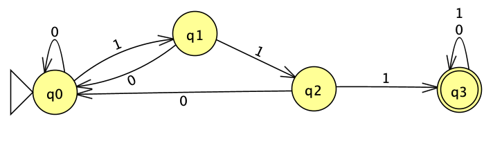

# Trabalho GA
#### Alunos: Fabiane Kuhn e Rafael Corrêa
## 1. As seguir são apresentadas as regras de produção de uma gramática capaz de gerar uma linguagem de programação muito simples, cujo símbolo inicial é P:

$$P \rightarrow\ LD\ \{LC\}$$
$$LD \rightarrow \varepsilon\ |\ D\ LD$$
$$D \rightarrow TV;$$
$$V \rightarrow x\ |\ y$$
$$T \rightarrow int | char$$
$$LC \rightarrow \varepsilon\ |\ C\ LC$$
$$C \rightarrow V=E;\ |\ if\ (V)\ \{LC\};\ |\ while\ (V)\ \{LC\};$$
$$E \rightarrow V\ |\ N$$ 
$$N \rightarrow 0\ |\ 1$$

### Agora construa uma cadeia de derivação para os programas a seguir, gerados pela gramática acima:
- a) $\{x=1;\}$

$$LD\{\undergroup{LC}\}\ =>$$
$$LD\{\undergroup{C}\ LC\}\ =>$$
$$LD\{\undergroup{V}=E;LC\} =>$$
$$LD\{x=\undergroup{E};LC\}\ =>$$
$$LD\{x=\undergroup{N};LC\} =>$$
$$\undergroup{LD}\{x=1;LC\} =>$$
$$\{x=1;\undergroup{LC}\}\ =>$$
$$\underbrace{\{x=1;\}}$$

- b) $int\ x;\ int\ y;\ \{if\ (x)\ \{y=0\};\ x=1;\}$

$$LD\{\undergroup{LC}\}\ =>$$
$$LD\{\undergroup{C}\ LC\}\ =>$$
$$LD\{if\ (\undergroup{V})\{LC\};\ LC\}\ =>$$
$$LD\{if\ (x)\{\undergroup{LC}\};\ LC\}\ =>$$
$$LD\{if\ (x)\{\undergroup{C}\ LC\};\ LC\}\ =>$$
$$LD\{if\ (x)\{y=\undergroup{E};\ LC\};\ LC\}\ =>$$
$$LD\{if\ (x)\{y=\undergroup{N};\ LC\};\ LC\}\ =>$$
$$LD\{if\ (x)\{y=0\ \undergroup{LC}\};\ LC\}\ =>$$
$$LD\{if\ (x)\{y=0;\};\ \undergroup{LC}\}\ =>$$
$$LD\{if\ (x)\{y=0;\};\ \undergroup{C}\ LC\}\ =>$$
$$LD\{if\ (x)\{y=0;\};\ \undergroup{V}=E;\ LC\}\ =>$$
$$LD\{if\ (x)\{y=0;\};\ x=\undergroup{E};\ LC\}\ =>$$
$$LD\{if\ (x)\{y=0;\};\ x=\undergroup{N};\ LC\}\ =>$$
$$LD\{if\ (x)\{y=0;\};\ x=1;\ \undergroup{LC}\}\ =>$$
$$\undergroup{LD}\{if\ (x)\{y=0;\};\ x=1;\}\ =>$$
$$\undergroup{D}\ LD\{if\ (x)\{y=0;\};\ x=1;\}\ =>$$
$$\undergroup{T}V;\ LD\{if\ (x)\{y=0;\};\ x=1;\}\ =>$$
$$int\ \undergroup{V};\ LD\{if\ (x)\{y=0;\};\ x=1;\}\ =>$$
$$int\ x;\ \undergroup{LD}\{if\ (x)\{y=0;\};\ x=1;\}\ =>$$
$$int\ x;\ \undergroup{D}\ LD\{if\ (x)\{y=0;\};\ x=1;\}\ =>$$
$$int\ x;\ \undergroup{T}V;\ LD\{if\ (x)\{y=0;\};\ x=1;\}\ =>$$
$$int\ x;\ int\ \undergroup{V};\ LD\{if\ (x)\{y=0;\};\ x=1;\}\ =>$$
$$int\ x;\ int\ y;\ LD\{if\ (x)\{y=0;\};\ x=1;\}\ =>$$
$$\underbrace{int\ x;\ int\ y;\ \{if\ (x)\{y=0;\};\ x=1;\}}$$

2. Crie uma gramática para a linguagem {a
n
b
n
c
n
 | n≥0}
3. Crie autômatos finitos determinísticos que reconheçam as seguintes linguagens sobre o alfabeto
∑={0, 1} :
(a) {w | w possui 111 como subpalavra }

(b) {w | o sufixo de w é 000 }
(c) {w | o terceiro símbolo da direita para a esquerda de w é 1 }
4. Crie autômatos finitos não-determinísticos, com ou sem movimentos vazios, que reconheçam as
seguintes linguagens sobre o alfabeto ∑={a, b} :
(a) {w1w2w1 | w2 é qualquer palavra e |w1| = 3 }
(b) {w | o décimo símbolo da direita para esquerda de w é a }
